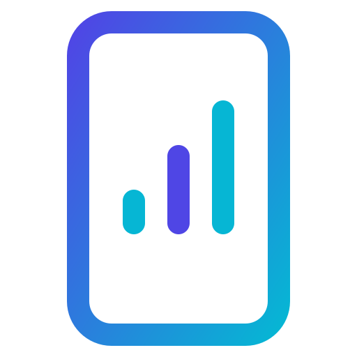

<p align="center">
  
</p>

<h1 align="center">סלולטור — מחשבון סלולר ממשלתי 2026</h1>

<p align="center">
  <strong>משרד התקשורת | פיתוח: דינה שרון</strong>
</p>

<p align="center">
  <a href="https://smart-digital-solutions.github.io/cellular-app/">
    
  </a>
  
  
  
  
</p>

<p align="center">
  <a href="https://smart-digital-solutions.github.io/cellular-app/">
    
  </a>
</p>

---

## 🔗 [להפעלת הסלולטור — לחצו כאן](https://smart-digital-solutions.github.io/cellular-app/)

---

## 📖 מה זה סלולטור?

**סלולטור** הינו מחשבון סלולר ממשלתי רשמי שפותח על ידי **דינה שרון** עבור **משרד התקשורת**. הכלי מאפשר לכלל עובדי המדינה הזכאים למכשיר סלולרי במסגרת מכרז הסלולר הממשלתי 2026 לחשב בקלות ובמהירות את עלויות הסלולר שלהם.

**סלולטור הוא כלי חינמי לחלוטין** — ללא צורך בהתקנה, הרשמה או סיסמה.

## 🚀 תכונות עיקריות

| תכונה | תיאור |
|--------|--------|
| 📱 **מחשבון השתתפות עצמית** | חישוב מדויק של ההשתתפות העצמית החודשית בתלוש השכר לפי דרגת זכאות ומחיר מכשיר |
| 📋 **מחשבון סיום ליסינג** | חישוב יתרת תשלומים וקנסות יציאה בעת סיום מוקדם של חוזה הסלולר |
| 🔧 **מחירון נזקים אינטראקטיבי** | השוואת עלויות השתתפות עצמית בנזקים לפי דרג ומכשיר |
| 📚 **מדריך מכרז סלולר 2026** | ריכוז נהלים, דגשים פיננסיים, SIM Only ומסלולים מיוחדים |
| ❓ **שאלות ותשובות** | מענה מקיף לשאלות נפוצות של עובדי מדינה |
| 🌙 **Dark Mode** | תמיכה מתקדמת ב-Dark Mode ללא הבהובים (FOUC) |
| ♿ **נגישות WCAG 2.1 AA** | עמידה מלאה בתקן ישראלי ת"י 5568 |

## 🛠 טכנולוגיה וארכיטקטורה

- **Frontend:** React 19 + Vite 8
- **Styling:** Tailwind CSS + Custom Design System (Oklch)
- **Data Engine:** Google Sheets API (gviz) — CMS ללא שרת (Serverless)
- **Fallback Engine:** מעבר אוטומטי לנתונים מקומיים בעת תקלה
- **Smart Caching:** שמירת נתונים לוקלית (Local Storage) לביצועים מהירים
- **Icons:** Lucide React

## 🏗 מבנה הפרוייקט

```
src/
├── screens/          # מסכי האפליקציה
│   ├── CalculatorScreen.jsx      # מחשבון עלויות
│   ├── TerminationScreen.jsx     # מחשבון סיום ליסינג
│   ├── MaintenanceScreen.jsx     # מחירון נזקים
│   ├── GuideScreen.jsx           # מדריך מכרז
│   ├── FaqScreen.jsx             # שאלות ותשובות
│   └── ...
├── components/       # רכיבי ממשק משותפים
├── sheetsService.js  # לוגיקה מול Google Sheets API
├── useAppData.js     # Custom Hook לניהול State
└── config.js         # הגדרות האפליקציה
```

## 🏃 הרצה מקומית

```bash
# התקנת תלויות
npm install

# הרצה במצב פיתוח
npm run dev

# בנייה ל-production
npm run build

# פריסה ל-GitHub Pages
npm run deploy
```

## 📄 תיעוד נוסף

- [אפיון נגישות מלא](./docs/CHARACTERIZATION.md)
- [דוח תאימות נגישות](./ACCESSIBILITY_COMPLIANCE.md)
- [מדריך תחזוקה](./MAINTENANCE.md)

---

<p align="center">
  <strong>גרסה:</strong> 1.5.0 (OMEGA v12.0)<br />
  <strong>פיתוח:</strong> <a href="https://smart-digital-solutions.github.io/cellular-app/">דינה שרון</a> | משרד התקשורת<br /><br />
  <a href="https://smart-digital-solutions.github.io/cellular-app/">🔗 סלולטור — מחשבון סלולר ממשלתי 2026 — משרד התקשורת — דינה שרון</a>
</p>
