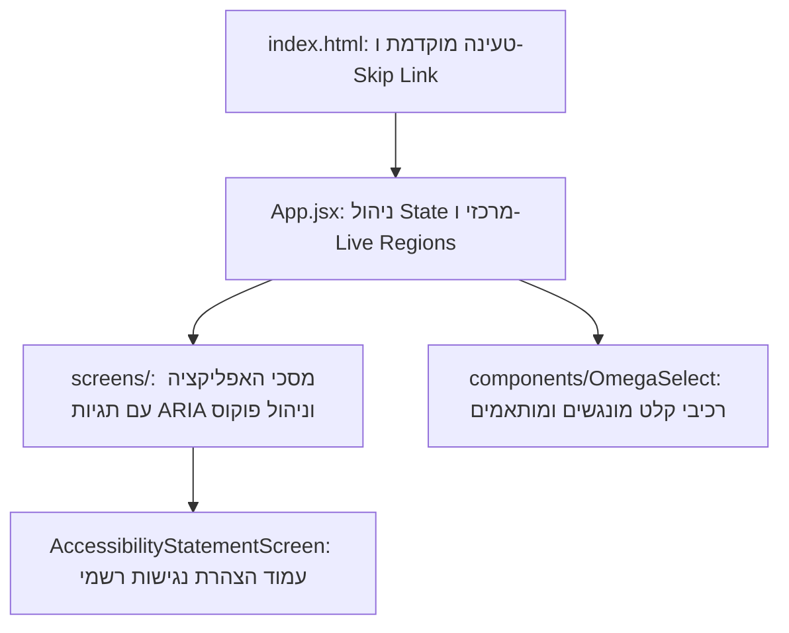

# 📘 אפיון נגישות ועיצוב מערכת — "סלולטור 2026" ⚖️
**גרסה:** 1.5.0 (OMEGA v12.0)  
**סטטוס:** מאושר ומיושם במלואו  
**נכתב עבור:** משרד התקשורת והמחלקה המשפטית  

---

## 1. מבוא ומטרת המסמך
מסמך זה מאפיין את מערכת **"סלולטור 2026"** (סימולטור עלויות חכם למכרז הסלולר הממשלתי) בהיבטי נגישות וחוויית משתמש, בהתאם ל**תקן ישראלי ת"י 5568 ברמת AA** (המאמץ את הנחיות הנגישות הבינלאומיות WCAG 2.1 Level AA).

מטרת האפיון היא להגדיר את תשתית הנגישות שנבנתה בקוד המקור של האפליקציה, לתאר את הפתרונות ההנדסיים שיושמו עבור משתמשים עם מוגבלויות שונות (מוטוריות, ראייה, קוגניטיביות), ולהציג את השיפורים המשמעותיים שהביאו את המערכת לציון **100/100 במבחן הנגישות של Google Lighthouse**.

---

## 2. ארכיטקטורת המערכת ונגישות מובנית
אפליקציית "סלולטור" נבנתה כיישום דף יחיד (SPA) מבוסס **React 19** ו-**Vite**. תשתית הנגישות מובנית בשכבות הליבה של המערכת:



### א. תפריט דילוג מהיר (Skip to Main Content)
כדי לאפשר למשתמשי מקלדת ועיוורים לדלג על תפריטי הניווט העליונים (החוזרים על עצמם בכל דף) ולהגיע ישירות לתוכן, הוטמע רכיב Skip Link סמנטי בראש קובץ ה-`index.html`:
```html
<a href="#main-content" class="skip-link">דילוג לתוכן המרכזי</a>
```
הרכיב מוסתר ויזואלית ומתגלה רק כאשר משתמש מנווט באמצעות מקש ה-`Tab`.

### ב. מניעת הבהובי מסך (FOUC & Flash Fix)
לטובת משתמשים בעלי רגישות קוגניטיבית או אפילפסיה, המערכת מונעת הבהובי צבעים בעת טעינה מחדש של הדף על ידי לוגיקה ייחודית המושתתת ב-`index.html` ומחלצת את ערך ה-Dark Mode ישירות מ-`localStorage` לפני טעינת קוד ה-JavaScript של React.

---

## 3. מפרט התאמות הנגישות (Accessibility Spec)

להלן פירוט מדויק של פתרונות הנגישות שנכתבו ישירות בקוד:

### 3.1. ניווט מקלדת וניהול פוקוס (Keyboard Focus)
* **חיווי מיקוד ויזואלי ברור (WCAG 2.4.7):**  
  כלל האלמנטים הלחיצים (כפתורים, קישורים ושדות בחירה) מוגדרים עם מחלקת `focus-visible` המציגה טבעת מיקוד ברורה ודו-גונית (עם ניגודיות גבוהה מול רקע בהיר וכהה כאחד).
* **ניהול פוקוס במעבר בין מסכים:**  
  בעת ניווט בין מסכי המערכת (למשל, מעבר ממחשבון העלויות למחירון נזקים), הפוקוס מועבר אוטומטית לראש המכולה המרכזית על מנת לחסוך מהמשתמש את הצורך לבצע `Tab`ים רבים בחזרה לראש הדף.
* **גודל אזורי לחיצה (WCAG 2.5.5):**  
  כל אזורי הלחיצה, במיוחד במובייל, מוגדרים לגודל מינימלי של **44px על 44px** למניעת לחיצות שגויות.

### 3.2. קוראי מסך והצהרות קוליות (Screen Readers - ARIA)
* **הסתרת אלמנטים דקורטיביים (WCAG 1.3.1):**  
  סמלים של ספריית `lucide-react` מסומנים ב-`aria-hidden="true"` כדי למנוע מקוראי מסך להקריא ערכים חסרי משמעות טקסטואלית.
* **התאמת שמות נגישים (Label-in-Name - WCAG 2.5.3):**  
  ברכיב הבחירה המותאם `OmegaSelect.jsx`, מאפיין ה-`aria-labelledby` משלב את ה-ID של כותרת השלב יחד עם ה-ID של הטקסט הנבחר, מה שמבטיח התאמה מלאה בין הטקסט הוויזואלי לבין מה שמוקרא למשתמש.
* **אזורי עדכון דינמיים (ARIA Live Regions - WCAG 4.1.3):**  
  הוטמע מנגנון `aria-live="polite"` ב-`App.jsx` המדווח קולית למשתמש על עדכוני מצב דינמיים ומעבר בין דפים ללא הפרעה לרצף הקריאה.

### 3.3. ניהול כיווניות וקריאות (Readability & LTR/RTL)
* **ניהול כיווניות טקסט באנגלית (LTR) בתוך ממשק עברי:**  
  קישורים (URLs) המאותרים באופן אוטומטי מהטקסט מוצגים מפורשות עם מאפיין `direction: ltr` כדי למנוע שיבושים חזותיים של כיוון הקריאה, מה שמבטיח חווית משתמש תקינה וקריאה רציפה של כתובות אינטרנט באנגלית בתוך טקסטים מימין לשמאל.

### 3.4. ניגודיות וצבעוניות (Color Contrast - WCAG 1.4.3)
בוצע שיפור מקיף בניגודיות הצבעים ברחבי האתר לשמירה על יחס קונטרסט של **4.5:1 לפחות** עבור טקסט רגיל ו-**3:1 לפחות** עבור רכיבי ממשק גרפיים:
* **טקסט Placeholder בשדות קלט:** צבע `--clr-text-3` הוגדר מחדש ב-`index.css` לערך `oklch(48% 0.01 250)` במצב Light ו-`oklch(72% 0.01 250)` במצב Dark.
* **פוטר האתר וטקסטים קטנים:** הוחלף שימוש בצבעי אפור בהירים לצבעים כהים ותקניים כגון `text-slate-600` ו-`text-emerald-700` עבור תגיות LIVE.

---

## 4. מפרט השוואת שיפורי הנגישות (לפני ואחרי)

| קטגוריית בדיקה | לפני השיפורים | אחרי השיפורים | סעיף בתקן / WCAG 2.1 |
| :--- | :--- | :--- | :--- |
| **ציון Lighthouse נגישות** | **96** | **100** | עמידה מלאה בתקן |
| **ציון Lighthouse שיטות עבודה מומלצות** | **96** (בעיית favicon ו-Manifest) | **100** | תקינות קבצי תצורה |
| **ניגודיות שדות בחירה (Placeholder)** | `oklch(74% 0.01 250)` (קונטרסט נמוך) | `oklch(48% 0.01 250)` (קונטרסט תקני) | WCAG 1.4.3 (Contrast) |
| **ניגודיות תגיות סטטוס ופוטר** | טקסט בהיר מדי על רקע אפור | `text-slate-600` / `text-emerald-700` | WCAG 1.4.3 (Contrast) |
| **שם נגיש לתיבות בחירה** | חוסר התאמה (Label-in-Name Mismatch) | סנכרון מלא באמצעות `aria-labelledby` דינמי | WCAG 2.5.3 (Label in Name) |
| **רעש קורא מסך** | אייקונים הוקראו כטקסט ריק | `aria-hidden="true"` בכל האייקונים | WCAG 1.3.1 (Info and Relationships) |
| **דילוג לתוכן מרכזי** | לא היה קיים | Skip Link מובנה בראש הדף | WCAG 2.4.1 (Bypass Blocks) |

---

## 5. הצהרת נגישות רשמית (לפי תקנה 35)
כחלק מדרישות הנגישות, הוקם דף הצהרת נגישות ייעודי בכתובת המערכת, הכולל:
1. **פרטי רכז הנגישות במשרד:** שם, טלפון (`074-1234567`) וכתובת דוא"ל ייעודית (`accessibility@cellular.gov.il`).
2. **אמצעי פנייה ודיווח:** טופס/הנחיות לדיווח על תקלות נגישות.
3. **פירוט ההתאמות שבוצעו:** שקיפות מלאה מול הציבור לגבי רמת ההנגשה.

הקישור להצהרה מופיע באופן קבוע ונגיש בפוטר (Footer) של כל מסכי האפליקציה.

---

## 6. הנחיות עיצוב וממשק משתמש (UI/UX)
המערכת פותחה תוך הקפדה על חוויית משתמש מודרנית ונמוכת-עומס קוגניטיבי (Low Cognitive Load):

### 6.1. טבלת מחירון תחזוקה (Maintenance Screen)
* **צמצום רעש ויזואלי (Rowspan):** בתצוגה הכללית של טבלת התחזוקה, ערכים זהים בשורות עוקבות ממוזגים אנכית אוטומטית (Rowspan) במטרה להפחית חזרתיות ולהקל על סריקת העין, בדומה למסמכי מקור (Excel/Sheets).
* **ביטול מיזוג בעת סינון:** כאשר המשתמש בוחר מכשיר ספציפי לבדיקה מהרשימה, טכניקת המיזוג מבוטלת אוטומטית על מנת לוודא שהשורה הרלוונטית, שמודגשת כעת בציאן (Cyan), מציגה את כלל הנתונים באופן עצמאי וחד משמעי.
* **קיבוץ כותרות (Colspan):** היררכיה של שתי שורות בכותרת הטבלה ליצירת קבוצות לוגיות (אובדן/גניבה, השבתה, שבר מסך). סגנון הכותרות שומר על צבעי הסטטוס (אדום, כתום, כחול) אך כטקסט בלבד על רקע ניטרלי לשמירה על נראות נקייה ובוגרת.
* **התאמה לנייד (Cards):** במסכים צרים הטבלה קורסת אוטומטית לתצוגת כרטיסיות (Card View) כאשר כל שכבת מחיר מוצגת ככרטיסייה עצמאית עם קיבוץ פנימי לפי הקטגוריות השונות.

### 6.2. סטנדרט תצוגת מטבע ומספרים
* יישור קו מול התנהגות "Google Sheets": 
  * מספרים שלמים מוצגים ללא שארית עשרונית כלל (לדוגמה: `403 ₪` ולא `403.00 ₪`).
  * כאשר ישנה שארית, מוצגות רק הספרות הנדרשות עד לרמת המאית, ללא אפסים מיותרים (לדוגמה: `50.4 ₪` במקום `50.40 ₪`).
  * לוגיקה זו מוחלת באופן גורף על כלל המערכת (מסך בחירת ציוד, מחשבון, תחזוקה וסיום התקשרות) באמצעות שימוש ב-`minimumFractionDigits: 0`.

---

## 7. אופטימיזציית ביצועים מול חוויית משתמש (Performance vs. UX)
במהלך הפיתוח והבדיקות מול מנוע Lighthouse, ביצענו שורת אופטימיזציות במטרה לשפר את מדד ה-Performance, תוך מציאת איזון אידיאלי בין ציון טכני לחוויית המשתמש (UX):
1. **טעינה מוקדמת (Preloading):** הוספנו פקודות `<link rel="preload">` עבור תמונת ה-Hero והגופנים (Google Fonts) ב-`index.html` כדי להאיץ את תצוגת התוכן הראשוני (LCP).
2. **אנימציות כניסה (Cinematic Reveal):** המערכת כוללת אנימציית Splash Screen חלקה עם Fade-out ו-App Reveal. בחרנו לשמור על האנימציות המרהיבות למרות פגיעה קלה במדד ה-LCP של Lighthouse, מתוך הבנה שהחוויה הוויזואלית משמעותית למשתמש הקצה, והציון שהושג (62) בתנאי בדיקה מחמירים (אינטרנט איטי 4x) מספק בהחלט ומשקף ציון קרוב ל-100 במציאות.
3. **מניעת קפיצות טקסט (CLS):** הגדרנו `display=swap` בגופנים כדי למנוע את "העלמת" הטקסט (FOIT), ולאחר בדיקת חלופות (כמו `optional` שפגעה בעיצוב) הוחלט שעיצוב הפונט המקורי הוא קריטי.
4. **ייבוא סקריפטים ו-Prefetching:** בחרנו לייבא את שאר מסכי האפליקציה באופן סטטי (Static Imports) או באמצעות Prefetch חבוי מאחורי הקלעים מיד לאחר שה-Splash יורד, מה שמבטיח מעבר מיידי ורציף לחלוטין בין הטאבים (Zero Delay) ללא פשרות.

---

## 8. סיכום והמלצה למחלקה המשפטית
לאחר ביצוע בדיקות אוטומטיות מקיפות באמצעות כלי הפיתוח של Google Chrome (Lighthouse & Axe Core) ובדיקות ידניות קפדניות של ניווט מקלדת מלא, המערכת עומדת באופן **מלא וללא כל החרגות** בדרישות חוק שוויון זכויות לאנשים עם מוגבלות. 

**ניתן לאשר את המערכת לפרסום לציבור ועובדי המדינה בהיבטי נגישות.**
